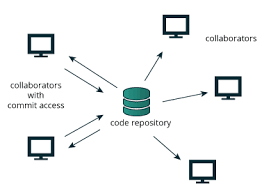
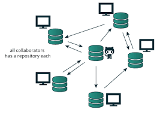
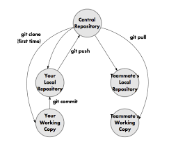
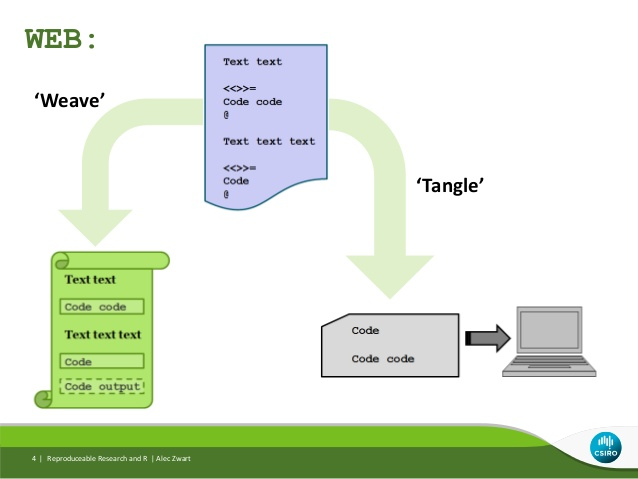
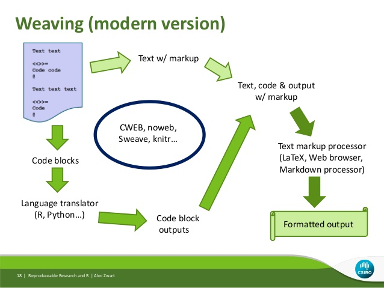

Reproducible analyses in bioinformatics with R
========================================================
author: Reinhard Simon, International Potato Center (CIP)
date: 20th November 2016
autosize: true
transition: fade

ISAS70 conference at ICRISAT, Hyderabad, India


Key theme
========================================================

**Bioinformatics as a reproducible digital 'experiment'**

A recent review in Biometrical Journal:


- More than 90% of the code submissions could not be fully reproduced at some stage


[Hofner, Schmid and Ebler: 2016](http://onlinelibrary.wiley.com/doi/10.1002/bimj.201500156/full)


Motivation
========================================================

Challenges

- How did I get to my results?
- Can I repeat easily my analysis on a similar data set?
- Can I understand it 6 months or 6 years from now?
- Is it easy to track my steps?


Objectives
========================================================

1. Learn tools for tracking changes (git & github)
2. How to organize files
3. How to create reproducible reports with markdown and knitr
4. How to make interactive reports
5. Modularizing your R code into packages
6. How to document functions
7. How to check that functions are correct
8. Other useful tools


Outline
========================================================

For each of the 7 sections there will be three parts:

1. short introduction of 5 to 10 min
2. demo
3. hands-on


Software
========================================================

Install (Windows)

- R
- Rtools
- git
- RStudio
- pandoc
- optional for PDF document versions: MikTex

R packages
========================================================

- devtools
- markdown
- roxygen2
- testthat
- knitr
- ...


Reference documents
========================================================

- [git cheatsheet](docs/github-git-cheatsheet.pdf)


1. Tracking changes using git - 1
========================================================

- Similar to word review mode



1. Tracking changes using git - 2
========================================================

Unlike prior source code tracking systems git

- can be used 'offline'
- can switch between repositories



1. Tracking changes using git - 3
========================================================

- Save & comment frequently using local 'commit'

- Push to repository at the 'end of day' (for backup and collaboration)
- Pull from repository at the 'start of day'



1. Tracking changes using git - 4
========================================================

- Register your github credentials at the outset

git config --global user.name "[name]"

git config --global user.email "[email address]"

git config --global user.password "[password]"


[cheatsheet](docs/github-git-cheat-sheet.pdf)


1. Tracking changes using git - 5
========================================================

[Restart] RStudio

- Should have now a git tab
- Supports only main tasks: commit & pull/push

- other frequent tasks
  - git branch
  - git merge


1. Tracking changes using git - 6
========================================================

https://github.com/c5sire/ISAS70course

- Copy address into the project wizard in RStudio is the most convenient
method.
- Setup your own account and then ‘fork’ and 'clone' the directory into your own repository.


2.  Organizing an analysis project - 1
========================================================

1. Maintain a common structure
2. Automate
3. One directory for each project
4. Separate final data from raw data
5. Separate code from data
6. Use relative paths
7. Choose file names carefully
8. Write ReadMe files


2.  Organizing an analysis project - 2
========================================================

- README.md
- src
- data
- data/code
- data/NOTEBOOK.md
- analyses
- docs/paper
- docs/presentation

2.  Organizing an analysis project - 3
========================================================


```r
  use_file(afile = "README.md",
           line = "What is where.")
  use_dir("src")
  use_dir("data")
  use_file("data/NOTEBOOK.md",
           "Note your steps.")
  use_dir(file.path("data", "code"))
  use_dir("analyses")
  use_dir("docs")
  use_dir(file.path("docs", "paper"))
  use_dir(file.path("docs", "presentation"))
```

2.  Organizing an analysis project - 4
========================================================


```r
  # Create a project directory if it not already exists
  # or use the current directory
  if(project_name != "."){
    if(!dir.exists(project_name)) dir.create(project_name)
    setwd(project_name)
    p_name = project_name
  } else {
    p_name = basename(getwd())
  }
```


2.  Organizing an analysis project - 5
========================================================


```r
 # Helper function to safely create directories
  use_dir <- function(adir){
    tryCatch({
      if (!dir.exists(adir)) {
        dir.create(adir)
        message(paste0("Created directory: ", adir))
      } else {
        message(paste0("Directory: ", adir, " already exists."))
      }

    }, error = function(e) {
      warning(paste0("Could not create directory: ", adir))
      }
    )
  }
```

2.  Organizing an analysis project - 6
========================================================


```r
# Helper function to safely create files
  use_file <- function(afile = "README.md",
                       line = "What is where in this project."){
    # Write the README.md file

    tryCatch({
      if (!file.exists(afile)) {
        write(paste0("# ", line ," *", p_name, "*"), file = afile)
        message(paste0("Created file: ",  afile))
      } else {
        message(paste0("File exists: ", afile))
      }
    }, error = function(e) {
      warning(paste0("Could not create file: ", afile))
    })
  }
```


2.  Organizing an analysis project - 6
========================================================


```r
# Use the function for example:
source("code/use_analysis.R")

use_analysis("my_project")
```

2.  Organizing an analysis project - 7
========================================================

## Explicit access to R packages used:


```r
utils::sessionInfo()
```

```
R version 3.3.1 (2016-06-21)
Platform: x86_64-apple-darwin13.4.0 (64-bit)
Running under: OS X 10.12.1 (Sierra)

locale:
[1] en_US.UTF-8/en_US.UTF-8/en_US.UTF-8/C/en_US.UTF-8/en_US.UTF-8

attached base packages:
[1] stats     graphics  grDevices utils     datasets  methods   base     

other attached packages:
[1] knitr_1.14

loaded via a namespace (and not attached):
[1] magrittr_1.5  formatR_1.4   tools_3.3.1   stringi_1.1.2 stringr_1.1.0
[6] evaluate_0.10
```


3. Reproducible reports with markdown and knitr - 1
========================================================

Reproducible Reports = literate programming (Donald Knuth, 1984):

  - A program should be understood by humans. It should read like an essay.
  - Vice versa: A statistical report should be reproducible.
  - Tools: WEB

3. Reproducible reports with markdown and knitr - 2
========================================================

<center>

</center>

3. Reproducible reports with markdown and knitr - 3
========================================================
- Sweave: in R since at least 2002 (Friedrich Leisch)
  - uses LaTex
  - powerful
  - still possible
  - but steep learning curve
- knitr: in R since 2012 (Yihui Xie)
  - can use several markup languages (including LaTex and HTML)
  - particular popular: markdown


3. Reproducible reports with markdown and knitr - 4
========================================================

<center>

</center>

3. Reproducible reports with markdown and knitr - 5
========================================================

Markdown

Demo with RStudio

3. Reproducible reports with markdown and knitr - 6
========================================================

A code fragment:
<pre>

```r
data(cars)
n = nrow(cars)
```

</pre>

Inserting a scalar into text:


```r
# The data set _cars_ has **`r n`** records.
```

3. Reproducible reports with markdown and knitr - 7
========================================================

Demo with RStudio


4. How to make interactive reports - 1
========================================================

See: [example](docs/innteractive.Rmd)

Add a plot: [example 2](docs/innteractive2.Rmd)


4. How to make interactive reports - 2
========================================================

Note: How to turn this presentation into a PDF for handouts:

```r
knitr::pandoc(‘Presentation.Rpres’, format=‘latex’)
```


4. How to make interactive reports - 3
========================================================

Notebooks

Demo: Rstudio


5. Modularizing your R code into packages - 1
========================================================
## Why a package?

- Organize and re-use your own functions
- Modularize, documment and test
- Increase quality of code
- Use examples for use case scenarios
- Use tests for checking correctness
- Use vignettes for tutorials
- Use github for preview releases
- Submit to CRAN when you have good production code; see CRAN rules
for update frequency

5. Modularizing your R code into packages - 2
========================================================

See the official R package documentation in your local help files (R/RStudio)

- However: if developing with R tools alone very tedious.
- Much easier: Use the devtools (H. Wickham) functions for supporting tools.


```r
devtools::create()
```

5. Modularizing your R code into packages - 3
========================================================

Demo: We will create a package for the use_analysis function.


6. How to document functions - 1
========================================================

Three levels:

- Document input, output, parameters
- Document simple use case: example
- Document in context: tutorial (R speech: vignette)


6. How to document functions - 2
========================================================

- Now very simple with roxygen2 / devtools.
  - make sure project options are set
- Use the RStudio documentation skeleton wizard to get started.

DEMO

6. How to document functions - 3
========================================================

- Put examples into inst/examples directory/
  - set correct reference in markup

DEMO

6. How to document functions - 4
========================================================

- add a vignette in a 2-step process
  devtools::use_vignette("MyTutorial")
  devtools::build_vignette()

DEMO

7. How to check that functions are correct
========================================================

Use testthat package.


```r
devtools::use_testthat()

testthat::auto_test_package()
```

On demand testing: Ctrl+Shift+T

DEMO

Learn more on R package buildig with devtools: [Wickham: R packages](http://r-pkgs.had.co.nz/)


8. Other useful tools for R in bioinformatics - 1
=======================================================

'Premature optimization is the root of all evil'

D. Knuth


Quick means to optimize execution:

- byte compiling code within R
- local parallel computing within R on a local machine with multiple cores


8. Other useful tools for R in bioinformatics - 2
=======================================================


```r
myfun <- function(){
  for(i in 1:1000){cat(i)}
}
myfunC <- compiler::compile(myfun)

library(microbenchmark)
microbenchmark(
  myfun,
  myfunC
)
```

8. Other useful tools for R in bioinformatics - 3
=======================================================


```r
# How many CPUs do I have
n = parallel::detectCores()
# Usually good idea to leave one core CPU (or node) free
n = n - 1
mc <- parallel::makeCluster(n)

# Then just pass the cluster object to a special version
# of an apply-type function
X = 1:1000000
f1 <- function(){             sapply(          X = X, FUN = sqrt)}
f2 <- function(){parallel::parSapply(cl =  mc, X = X, FUN = sqrt)}
```

8. Other useful tools for R in bioinformatics - 4
=======================================================

Re-create complete environment in the cloud using virtual machines (like docker)


Summary
=======================================================

- Keeping research reproducible is a constant challenge
- Bioinformatics or computational biology is no exception
- Document, document, document!
- R has several levels of support for reproducible research including support to
  - link data, results and final documents
  - modularize and
  - re-use


